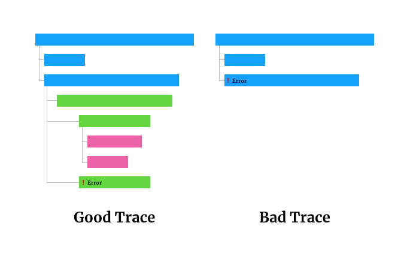

So you've probably heard of distributed tracing by this point.
We quickly went from it being a niche, new thing, to the thing everyone is talking about.
And it's no wonder, distributed tracing promises you the best of both worlds, context-aware debugging and micro services.
You can ship your org chart and monitor it too.

The issue is that for most organizations it requires a monumental effort to get your systems instrumented.
Distributed tracing is only useful when you have close to full coverage of your system.
Otherwise, while you are debugging an issue you'll hit a wall.
The traces will all have massive black boxes representing all the work down by other services.
No visibility.

So how do you go from no tracing to a fully traced system?
You have a interesting cold start problem on our hands.
You could make it a company-wide initiative.
You could get all your engineers in a room, evangelize the merits of the technology.
You could explain to them that it's a good idea, and that it's an investment in their future.
You could explain that although they won't see any benefits until everyone has done their part, that it's a worthwhile endeavor.
You could ask them to trust you.

But hey, let's be real.
That's not likely to work.
You work at a massive company, it's hard to mobilize all the troops.
You know how many meetings that will entail?
You know how many roadmaps that'll disturb?

*Ah, but Thomas, you see I work at a startup!* Cool.
Still probably isn't going to work.
You have to build features, remember?
Grow or die.

The issue with this approach is that you need to motivate your engineers to care about tracing, but until they all do, none of them will receive the benefits.

Instead, you should figure out a way to give it to them for free.
If every engineering gets tracing automatically, then they don't have to learn about tracing.
If there service automatically propagates the trace identifier, upstream and downstream services will be able to see how traffic flows in and out of their service.
The author of the service doesn't even have to know! When the time comes when someone needs to look at some traces, they can see the benefit of the system because it already has 100% coverage.
It's at this point that the value of distributed tracing starts to set in.
This is when your engineers can start exploring the production traces.
After poking around, they'll realize they want more detail.
That's when your engineers become self motivated to add tags to the auto-generate spans and create their own new spans to fill out the internal details of their services.

This is exactly what we did at [Stitch Fix](https://twitter.com/stitchfix_algo).

We introduces an internal opinionated web framework in our most used language, Python.
This framework wrapped an open-source web framework (think [Flask](http://flask.pocoo.org)).
When a request handler was registered with the framework, we'd wrap the handler to pull off any of the opentracing headers and stick it in a request-local storage.
We'd then create a new span with whatever details we could glean from the incoming request – ip address, HTTP method, request size, etc.
Then we'd call the provided request handler.

We also wrapped our HTTP request library (think [Requests](http://docs.python-requests.org/en/master/)).
Whenever an HTTP request was made, we'd pull out the opentracing information from the aforementioned request-local storage, then attach it to the headers of the outbound HTTP request.

Without uttering the words "distributed tracing", every new service built would have it out of the box.
When old services were deployed with new features, the build process would pick up the latest version of the framework.
Within a month we had full coverage.

It was then we could send out an email explaining the benefits of distributed tracing.
At the bottom of the email, a link to [LightStep](https://lightstep.com).
*Here's your traces, go explore!*
